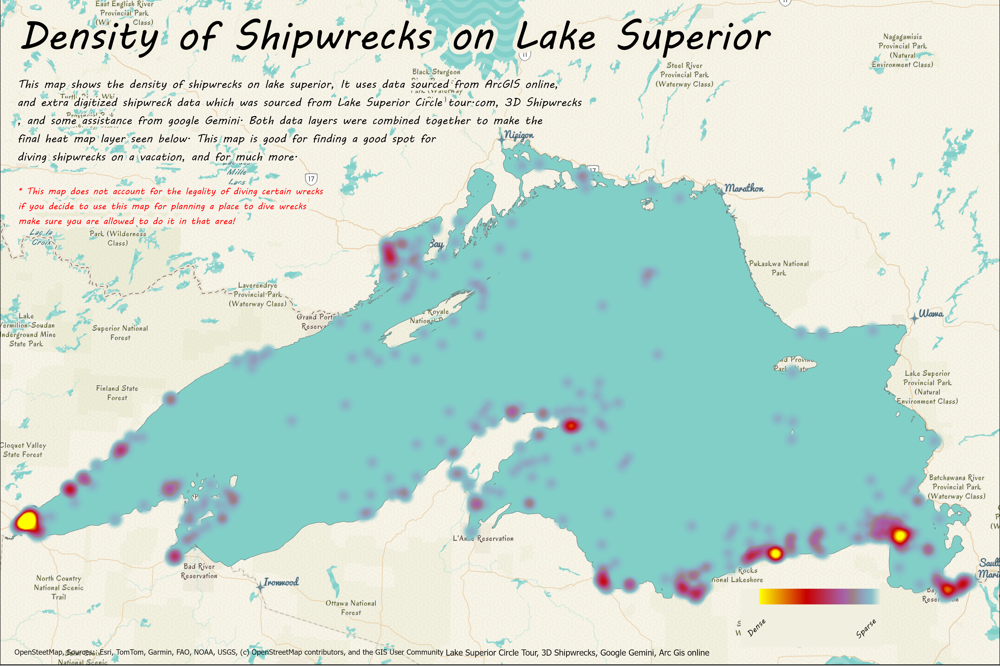
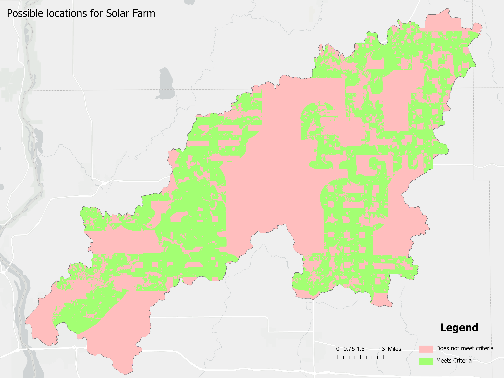
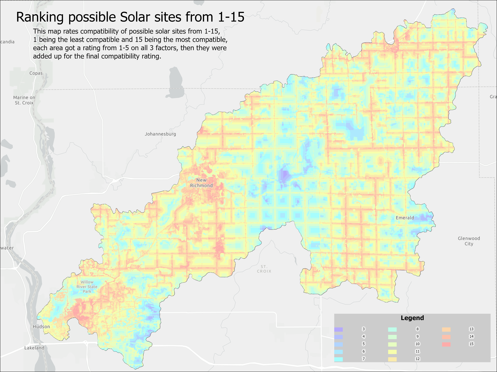
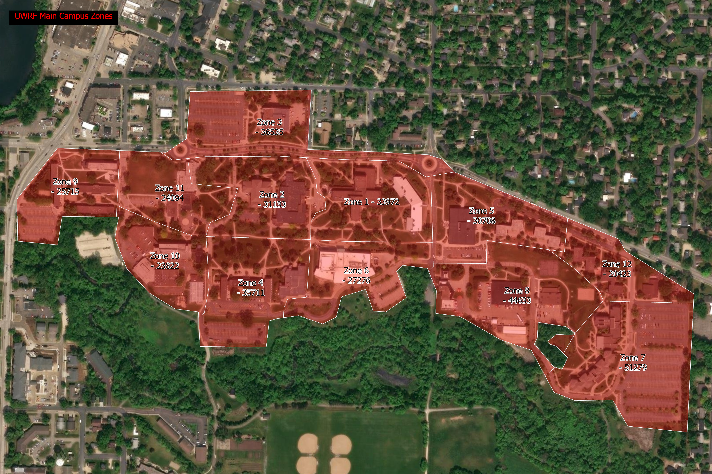
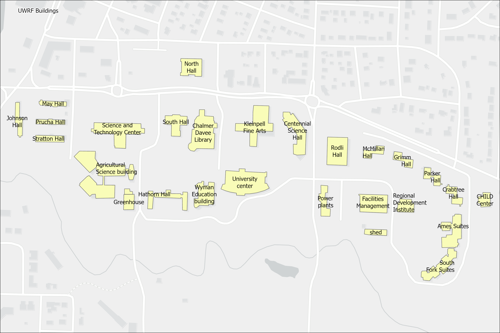
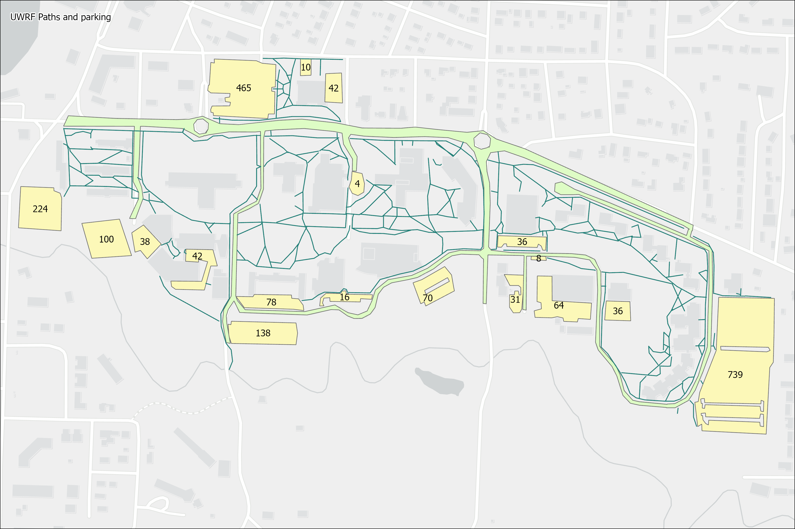

<!-- #TimothyFurlong.github.io -->
<!-- INSERT PROFILE PHOTO HERE -->  
Timothy Furlong's GIS Portfolio  
## Welcome  
I am a student at the University of Wisconsin, River Falls. I have a major in Computer Science and a minor in Geographic Information Systems.  
I enjoy various aspects of GIS, Including Geospatial analysis, story maps, and more. I have experience in ArcGIS Online and ArcGIS Pro.  
My background in Computer Science has also uplifted my skills in GIS with experience in related languages such as Python.  
I have worked on various projects in GIS, from classes to personal projects. These projects have given me experience in many different parts of GIS.  
from digitizing data, analysis, story maps, etc.
## Projects
### Personal

## School  
The next two maps are from a project where I had to determine compatible locations for solar farms in the Willow River watershed in Wisconsin.  
I used tools to determine compatibility based on distance to roads and power lines, based on given data, and whether the land was a wetland or water  
based on land cover data from the USGS. The first map shows whether the land was compatible or not. The second map ranks the compatibility from 
1-15 based on the type of land, and distance to roads and power lines, 1 being the least compatible, and 15 being the most compatible.  

The next three maps are from a project I was assigned to, where I had to create data based on zones, buildings, and paths of the UWRF campus 
based on satellite imagery and using heads-up digitizing. The maps show zones of the UWRF Campus and the area, Campus Buildings,  
and the paths/parking lots of the Campus. The parking lots show approximately the total number of parking spots in each  
parking lot. The number is estimated based on satellite imagery.

